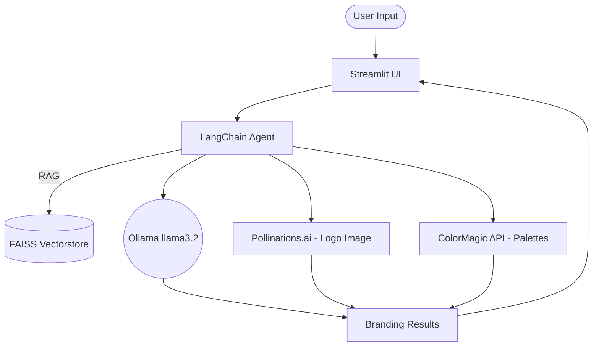

#  llm-brand-generator

An AI-powered branding assistant that generates **brand name, slogan, and concept visuals** from a simple description.  
It uses **LangChain + Ollama** for text generation and (for now) a simple placeholder image generator.  

---

##  How to use it?

Simply provide a description of your desired brand AND click on 'Generate Branding':

<div align="center">
 
</div>


After approximately one minute, you will receive the recommended items:

- A suggested name
- A suggested slogan
- A branding concept
- A logo mark
- A palette of colors

<div align="center">
 
</div>

---


##  How its works?

This project combines **local LLMs with cloud APIs** to generate branding suggestions:

1. **Ollama (local LLM runtime)**  
   - You need to have [Ollama](https://ollama.ai) installed on your system.  
   - The Python code (via `langchain-community`) connects to Ollama’s local server (default: `http://localhost:11434`) using the model `llama3.2`.  
   - Ollama handles downloading, storing, and running the model.  

2. **LangChain (retrieval + prompting)**  
   - Loads reference documents from the `docs/` folder (PDF/TXT).  
   - Uses **FAISS** to build or reuse a vector store.  
   - Provides context to the LLM for better branding suggestions.  

3. **Branding generation process**  
   - You describe your business/idea in the Streamlit interface.  
   - The app queries Ollama with context + your description.  
   - The model outputs:
     - **Brand Name**  
     - **Slogan**  
     - **Logo Mark idea**  
     - **Color**  
     - **Branding Concept**  

4. **Visual generation**  
   - **Logo image** is generated using [Pollinations.ai](https://pollinations.ai).  
   - **Color palette** is fetched from [ColorMagic](https://colormagic.app) and overlaid with the slogan.  

### System Architecture




---

##   Setup

### 1. Create a virtual environment

```
cd llm-brand-generator/
python3 -m venv venv
```

### 2. Activate the environment

```
source venv/bin/activate
```

### 3. Install dependencies

```
pip install -r requirements.txt
```
streamlit run app.py


### 4. Install and run Ollama

- Make sure you have Ollama installed on your machine.
- If not, download it from: https://ollama.com/download
- Then pull the required model:

```
ollama pull llama3.2
```

You can test if the model is working by running:

```
ollama run llama3.2 "Hello world"
```

### 5. Run the app

```
streamlit run app.py
```

###  Debug

- Basic way: just run this command

```
streamlit run app.py --logger.level=debug

```

- Step by step (VS Code): create a .vscode/ folder and inside create a launch.json file with:

```
{
  "version": "0.2.0",
  "configurations": [
    {
      "name": "Debug Streamlit",
      "type": "python",
      "request": "launch",
      "program": "app.py",
      "args": [
        "run",
        "app.py",
        "--logger.level=debug"
      ],
      "console": "integratedTerminal"
    }
  ]
}
```

For conditional parts, just use something trivial like if 2 > 1 to ensure the code executes and logging continues.

- Interactive debug (terminal only): this will pause execution in the terminal, and you can inspect variables step by step.

```
import pdb; pdb.set_trace()
```

##  Project Structure

```
llm-brand-generator/
├─ app.py                # main interface (Streamlit + integration)
├─ agent.py              # LangChain agent + RAG pipeline
├─ assets.py             # base64 images and icons for the interface
├─ pollinations_api.py   # image generation (Pollinations.ai)
├─ colormagic_api.py     # integration with ColorMagic API (color palettes)
├─ embeddings/           # scripts to generate embeddings
│   └─ build_embeddings.py
│
├─ docs/                 # reference documents (PDF, TXT)
│   ├─ branding_guide.txt
│   └─ marketing_tips.pdf
│
├─ requirements.txt      # project dependencies
└─ vectorstore/          # FAISS store (created automatically)
   └─ index.faiss
```

---

<div align="center">
  
</div>
